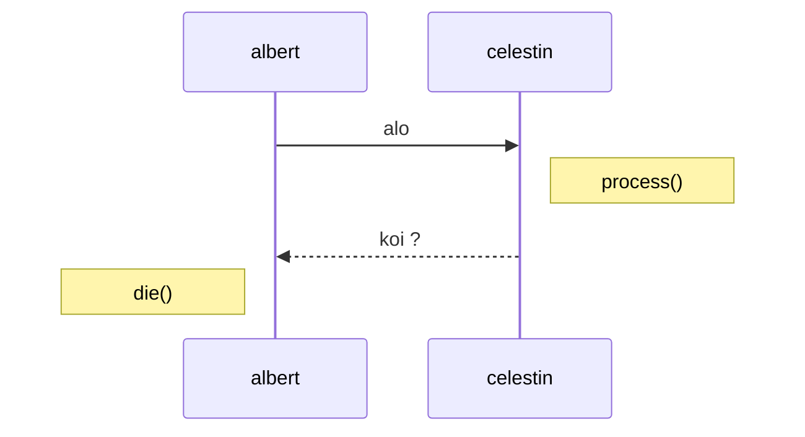

# articlewebsite
Projet SQL/PHP Site d'articles :: __VROOM__

## propositions d'emplois
* pages PHP :couple_with_heart_woman_woman:
- [ ] "logout.php" déconnexion utilisateur ```php <?php session_start(); ?> ```
- [ ] "user_infos.php" informations utilisateurs eye_candy _en cours_
- [X] "accueil.php" qui propose les deux derniers articles et un message de coucou
- [X] "articles.php" qui affiche juste tous les articles

* intégrations :man_juggling:
- [X] Créer 4 articles dans la database
- [ ] passer par create_user.php pour se faire l'utilisateur: _celestin@gmail.com_ pass : _celestin_
- [X] faire le "menu.php" à intégrer ensuite en #include sur toutes les pages .php (sauf create_user.php pour le moment)
- [X] fusionner le code bootcrap avec les pages php backend pour que ce soit impressionnant _en cours_
- [ ] désactiver les liens devenus inutiles dans "part/menu.php" quand on est loggé
```php
<?php
    if(!isset($_SESSION['user'])){
        echo '<li><a href="create.php">connex</a></li>';
    }
?>
```

* si c'est fini et que l'on est trop fort :business_suit_levitating:
- [ ] activation de compte par email SMTP
> https://m-gut.developpez.com/tutoriels/php/mail-confirmation/
- [ ] reset password de compte par email SMTP
- [ ] moteur de recherche des articles
> (copy/paste "ex22-form_searchengine")

* pour s'occuper :man_facepalming:
- [ ] faire le clone de wordpress

### tit's soucis

* pulseaudio, what da hell
* désactive les journaux systemctl
* samba 192.168.2.10 ? test déjà ton propre ip.
* clock win-dos recule d'une heure
* récupérer anciens favoris, nettoyer historique sur windos
* [X] logout :: comportement espace taff -> verrouillage
* installation petit serveur simple SMTP :: postfix

### consigne
`Projet PHP procédural :`
```text
    Le but est de créer un petit site de gestion et d'affichage d'articles.

    Ce site devra être travaillé par groupes et devra être versionné sur un dépôt
    github partagé avec le formateur. GIT EST OBLIGATOIRE.

    Le front devra être travaillé le minimum possible, utilisation de bootstrap 4 obligatoire.
    METTEZ L'ACCENT SUR LE BACKEND !

    1) Créer une nouvelle base de données avec le nom de votre site qui devra comprendre deux tables :
    Une table "users" et une table "articles". (Le schéma MCD devra être présent sur le dépôt GIT)

    2) Créer le système d'authentification du site qui devra comprendre :
        - Une page d'inscription
        - Une page de connexion
        - Une page de déconnexion
        - Une page de profil (affichage des infos personnelles de la personne connectée)

    3) Créer les pages qui serviront à voir la liste des articles et voir un article en
    entier (son titre, son contenu, auteur, etc...)

    4) La page d'accueil devra afficher les deux derniers articles parus sur le site en version raccourcis.

    ! BONUS À FAIRE SEULEMENT QUAND TOUT LE RESTE EST FAIT ET VALIDÉ PAR LE FORMATEUR

    5) Faire un système d'activation de compte par email à l'inscription

    6) Faire un système de réinitialisation de mot de passe par email

    7) Créer une page avec un moteur de recherche des articles

    8) Faire un backoffice de gestion des articles/users (créer, supprimer, etc...)
```

### creat0rs
- <https://github.com/Britrvl>
- <https://github.com/mikhaddo>
- <https://github.com/Murat389>
- <>

#### Neimp


